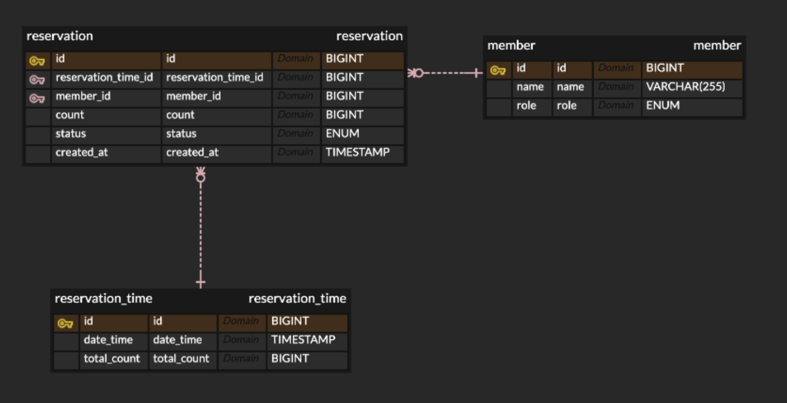

# grepp-assignment

## 프로젝트 구조

```
app/
│
├── config/
│   └── database.py              # 데이터베이스 설정
│
├── controllers/
│   └── reservation_controller.py  # 예약 관련 API 엔드포인트
│
├── services/
│   └── reservation_service.py    # 예약 비즈니스 로직
│
├── repositories/
│   └── models.py                # DB 모델 정의 (SQLAlchemy 모델)
│
├── dtos/
│   └── schemas.py               # 데이터 전송 객체 (Pydantic 모델)
│
├── exceptions/
│   └── exceptions.py             # 예외 처리 정의
│
└── main.py                      # FastAPI 애플리케이션 진입점
```

### 예약 조회, 신청

- [x] 고객은 예약 가능 시간을 조회할 수 있다.
- [x] 고객은 예약을 신청할 수 있다.
- [x] 고객은 본인이 등록한 예약만 조회할 수 있다.
- [x] 어드민은 모든 고객의 예약을 조회할 수 있다.

### 예약 수정 및 확정

- [x] 어드민은 모든 고객의 예약을 확정할 수 있다.
- [x] 고객은 예약 확정 전에 예약을 수정할 수 있다.
- [x] 어드민은 모든 고객의 예약을 수정할 수 있다.

### 예약 삭제

- [x] 고객은 확정 전에 예약을 삭제할 수 있다.
- [x] 어드민은 모든 고객의 예약을 삭제할 수 있다.

## 테스트 데이터 요약

### 1. 예약 시간 (ReservationTime)

| 예약 시간       | 예약 인원 |
|----------------|----------|
| **예약 시간 1** | 45,000명  |
| **예약 시간 2** | 100명     |
| **예약 시간 3** | 3,000명   |
| **예약 시간 4** | 50,000명  |
| **예약 시간 5** | 0명       |

### 2. 회원 (Member)

| 이름           | 역할        |
|----------------|------------|
| **Admin User** | **ADMIN**  |
| **Customer 1** | **CUSTOMER**|
| **Customer 2** | **CUSTOMER**|
| **Customer 3** | **CUSTOMER**|
| **Customer 4** | **CUSTOMER**|

### 3. 예약 (Reservation)

#### Customer 1
- **예약 시간 1**: 40,000명 예약, 상태: **CONFIRMED** (확정)
- **예약 시간 2**: 100명 예약, 상태: **CONFIRMED** (확정)

#### Customer 2
- **예약 시간 4**: 50,000명 예약, 상태: **CONFIRMED** (확정)

#### Customer 3
- **예약 시간 3**: 3,000명 예약, 상태: **CONFIRMED** (확정)
- **예약 시간 1**: 5,000명 예약, 상태: **CONFIRMED** (확정)
- **예약 시간 3**: 25,000명 예약, 상태: **PENDING** (대기)

#### Customer 4
- **예약 없음**: 아무 예약도 하지 않음

---

이 데이터는 서버가 시작될 때 자동으로 삽입됩니다.

## ERD


## [API 명세](https://yellow-pizza-d72.notion.site/API-1b6a8205c9318079acbed0100ced2e58?pvs=4)


## 환경설정 및 실행방법

**참고사항**

- **데이터베이스 초기화**: 프로젝트 실행 시 더미 데이터가 삽입되며, 서버 종료 시 테스트 데이터가 삭제되도록 lifespan을 활용하는 코드가 포함되어 있습니다.
- **시간대 처리**: 프로젝트에서는 pytz를 사용하여 한국 시간(KST)을 설정하고 있습니다.

> **Python**: Python 3.10 이상이 설치되어 있어야 하며, 가상환경(.venv)을 생성할 수 있어야 합니다.
**PostgreSQL**: 데이터베이스 서버가 설치되어 실행 중이어야 하며, `app/config/database.py`에 올바른 연결 문자열이 설정되어 있어야 합니다.
> 

### 실행 방법 1

- 프로젝트에 포함되어있는 `run.sh` 실행 혹은 `run.bat` 실행하는 방법

**실행권한 부여**

> **Mac**
> 

```java
chmod +x run.sh
./run.sh
```

> **Window**
> 

```java
run.bat
```

### 실행 방법 2

> **Mac**
> 

```java
// 해당 프로젝트 내에서

source .venv/bin/activate

# 의존성 설치 (이미 설치되어 있다면 건너뛰어도 됩니다)
pip install -r requirements.txt

# Uvicorn을 사용하여 FastAPI 앱 실행 (코드 변경 시 자동 재시작)
uvicorn app.main:app --reload
```

> **Window**
> 

```java
// 해당 프로젝트 내에서

// 가상환경 활성화 (가상환경 이름이 .venv인 경우)
call .venv\Scripts\activate

// 의존성 설치 (필요한 경우, 이미 설치되어 있다면 건너뛰어도 됩니다)
pip install -r requirements.txt

// Uvicorn을 사용하여 FastAPI 앱 실행 (코드 변경 시 자동 재시작)
uvicorn app.main:app --reload
```